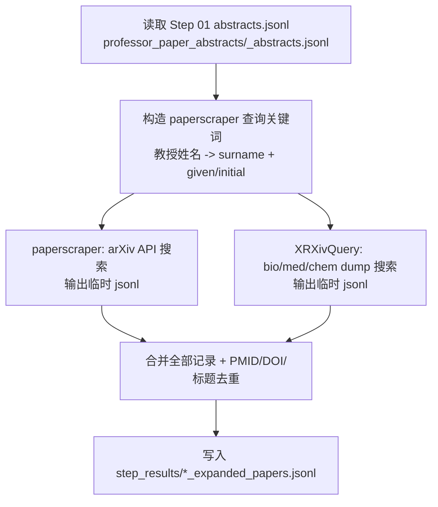

# 02_paper_list_extend / processing（扩展论文列表采集；纯爬虫，无 ML）

## 目标（ML参与：❌）

从 `01_data_collection` 已采集的“教授论文元数据”（至少包含 `title/abstract/pub_date/doi/authors`）出发，抓取：

- arXiv：通过 paperscraper 的 arXiv API
- bioRxiv/medRxiv/chemRxiv：通过 paperscraper 的 server dump（本地索引文件）

输出一个“扩展论文元数据 JSONL”：

- `02_paper_list_extend/step_results/*_expanded_papers.jsonl`
- 字段包含：`paper_id, source, source_id, title, abstract, pub_date, authors, doi, url`

并对重复论文进行去重（优先 `doi`，否则按归一化 `title`）。

## 架构与执行逻辑（建议）



## 必要前置条件

1. 安装依赖（当前项目已统一安装到根目录 `.venv`）
```powershell
py -3.12 -m venv .venv
.\.venv\Scripts\python.exe -m pip install --upgrade pip
.\.venv\Scripts\python.exe -m pip install paperscraper
```

2. 下载 bioRxiv/medRxiv/chemRxiv 的 server dumps（本地部署关键；耗时较长）

推荐使用本项目提供的下载脚本（会下载到 Step 02 自己的 data_sources 目录）：

```powershell
.\.venv\Scripts\python.exe 02_paper_list_extend/processing/download_step02_paperscraper_dumps.py --recent-days 30
```

3. 准备 Step 01 输出：
- `01_data_collection/step_results/<Step01OutputPrefix>_abstracts.jsonl`
- 环境模板：`02_paper_list_extend/processing/.env.example`

## 准确执行命令（Step 02）

脚本位置：
- `02_paper_list_extend/processing/run_step02_paper_list_extend_paperscraper.py`

主命令（直接运行）：

```powershell
.\.venv\Scripts\python.exe "02_paper_list_extend\processing\run_step02_paper_list_extend_paperscraper.py" `
  --professor-name "教授姓名" `
  --step01-output-prefix "Step01OutputPrefix" `
  --output-prefix "Step02OutputPrefix" `
  --server-dump-dir "02_paper_list_extend/data_sources/paperscraper_server_dumps/server_dumps"
```

本地部署优先（推荐用于“先跑通与验收”；跳过不稳定的 arXiv 远端 API）：

```powershell
.\.venv\Scripts\python.exe "02_paper_list_extend\processing\run_step02_paper_list_extend_paperscraper.py" `
  --professor-name "教授姓名" `
  --step01-output-prefix "Step01OutputPrefix" `
  --output-prefix "Step02OutputPrefix" `
  --server-dump-dir "02_paper_list_extend/data_sources/paperscraper_server_dumps/server_dumps" `
  --skip-arxiv
```

你也可以显式指定 abstracts json 路径（当你不想依赖 `--step01-output-prefix` 推断）：

```powershell
.\.venv\Scripts\python.exe "02_paper_list_extend\\processing\\run_step02_paper_list_extend_paperscraper.py" `
  --professor-name "教授姓名" `
  --step01-abstracts-json "01_data_collection\\step_results\\Step01OutputPrefix_abstracts.jsonl" `
  --output-prefix "Step02OutputPrefix"
```

输出：
- `02_paper_list_extend/step_results/Step02OutputPrefix_expanded_papers.jsonl`

> 说明：脚本默认从当前工作目录的 `server_dumps/` 目录寻找 `bioRxiv/medRxiv/chemRxiv` dumps；稳定字段与路径契约以 `shared/config/professor_pipeline.io.contract.yaml` 为准。

## Step01 -> Step02 相关性（已验证）

Step 02 输出中 `source=pubmed` 的部分，会**原样保留** Step 01 的论文记录（PMID/标题/摘要/时间/DOI/作者），并在此基础上追加 `biorxiv/medrxiv/chemrxiv/arxiv` 等来源的扩展论文元数据。

