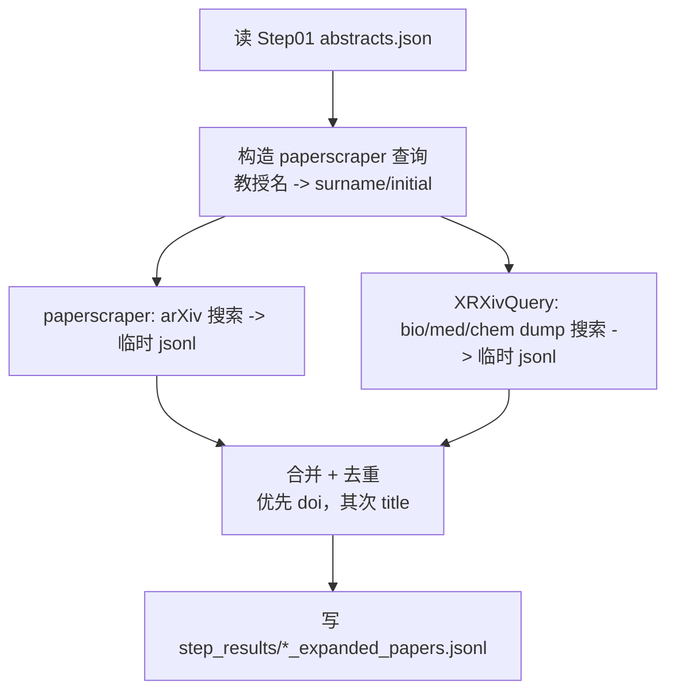

# 教授项目投入精力推断（本地优先）

## 1）项目基础介绍（输入 -> 结构化结果 -> 投入推断）

你输入：`教授名 + 指定论文网址（建议 PubMed 链接）`。系统会输出：
- `标题/摘要/发表时间`（`json` + `md`）
- 基于“领域/项目”推断的当前投入比例与未来趋势
- 通过同名教授消歧尽量排除非目标教授的不同领域论文

已保留并可直接使用：`01_data_collection`（Step 01 数据采集链路）。

当前已完成的统一环境准备：
- 项目根 `.venv` 已创建
- 已安装：`paperscraper`、`scipdf-parser`、`gliner`、`keybert`、`sentence-transformers`、`hdbscan`、`umap-learn`、`scikit-learn`、`pandas`
- 统一配置模板：`shared/config/professor_pipeline.env.example`
- 统一输入输出契约：`shared/config/professor_pipeline.io.contract.yaml`

## 2）时间架构（02-07；对应你的技术栈明细）

### Step 02：扩展论文列表采集（02_paper_list_extend）
- 输入：Step 01 的论文元数据（至少：`title/abstract/pub_date/authors/doi`）
- 工具：`paperscraper`（arXiv/bioRxiv/medRxiv/chemRxiv；纯爬虫，ML 参与：❌）
- 输出：`02_paper_list_extend/step_results/*_expanded_papers.jsonl`
  - 字段：`title, abstract, pub_date, authors, doi, url, source`

架构与执行逻辑（简图）：



依赖与准备：

```powershell
py -3.12 -m venv .venv
.\.venv\Scripts\python.exe -m pip install --upgrade pip
.\.venv\Scripts\python.exe -m pip install paperscraper
```

下载 bioRxiv/medRxiv/chemRxiv server dumps（耗时较长；生成本地 `server_dumps/*`）：

```powershell
.\.venv\Scripts\python.exe -c "from paperscraper.get_dumps import biorxiv; biorxiv()"
.\.venv\Scripts\python.exe -c "from paperscraper.get_dumps import medrxiv; medrxiv()"
.\.venv\Scripts\python.exe -c "from paperscraper.get_dumps import chemrxiv; chemrxiv()"
```

执行命令（准确运行）：

```powershell
.\.venv\Scripts\python.exe "02_paper_list_extend\processing\run_step02_paper_list_extend_paperscraper.py" `
  --professor-name "教授姓名" `
  --step01-output-prefix "Step01OutputPrefix" `
  --output-prefix "Step02OutputPrefix"
```

### Step 03：PDF 解析与元数据提取（03_pdf_parsing）
- 输入：Step 02 的 PDF
- 工具：`GROBID`（Docker；本地）+ `scipdf_parser`
- 输出：结构化 `JSON`（标题、摘要、作者列表、发表日期、关键词、参考文献）

启动命令：

```powershell
docker compose -f 03_pdf_parsing/processing/docker-compose.grobid.yml up -d
```

### Step 04：同名教授消歧（04_author_disambiguation）
- 输入：论文标题/摘要/作者/机构（含 Step 03 信息）
- 工具：`WhoIsWho`（OAG-BERT）+ `GLiNER`
- 输出：过滤后的“目标教授论文集合”

### Step 05：关键词与实体抽取（05_keyword_entity）
- 输入：目标论文的标题 + 摘要（可含机构/引用）
- 工具：`KeyBERT` + `GLiNER`
- 输出：
  - `keywords[]`：关键词/技术方向（项目名候选）
  - `entities[]`：方法/模型/技术实体
  - 项目（Project）构造建议：高频 n-gram + 技术实体 + 规范化同义合并

### Step 06：领域聚类（06_domain_clustering）
- 输入：所有论文摘要/关键词拼接文本
- 工具：`sentence-transformers` + `HDBSCAN`（可选 `UMAP`）
- 输出：每篇论文 `domain_label` + 领域列表/代表关键词

### Step 07：时间分析与投入精力推断（07_temporal_analysis）
- 输入：发表日期 + `domain_label` + `project` + 身份一致性权重（Step 04）
- 输出：
  - `share_current`：当前投入比例（按领域/项目加权）
  - `trend_future`：未来趋势
  - `consistency_report`：领域分布突变提示（同名混入风险）

轻量实现建议：
- 时间序列：`count(t)`；当前权重指数衰减 `w(t)=exp(-(T-now)/tau)` 得到 share_current
- 未来预测：对最近窗口做趋势拟合/平滑
- “训练一个模型”最小可行：`sklearn` baseline 预测下一时间窗是否继续出现于同一 project/domain

## 3）推荐执行顺序与命令（先跑通 Step 01）

### 3.1 Step 01：教授论文 titles/abstracts/lab_info

如果你有 PubMed seed `PMID`（建议从“论文网址”提取 PMID）：

```powershell
powershell -ExecutionPolicy Bypass -File "scripts\bootstrap\run_professor_collection_simple.ps1" `
  -ProfessorName "教授名" `
  -SeedPaperTitle "种子论文标题" `
  -SeedPMID "种子 PMID"
```

可选追加额外 URL（辅助证据）：

```powershell
powershell -ExecutionPolicy Bypass -File "scripts\bootstrap\run_professor_collection_simple.ps1" `
  -ProfessorName "教授名" `
  -SeedPaperTitle "种子论文标题" `
  -SeedPMID "种子 PMID" `
  "新URL" "新URL"
```

Step 01 输出将作为 Step 02~07 的输入来源：
- `01_data_collection/step_results/<前缀>_abstracts.jsonl`
- `01_data_collection/step_results/<前缀>_abstracts.md`
- `01_data_collection/step_results/<前缀>_lab_info.json`

### 3.2 Step 02~07：目录串接（待你补齐入口脚本）
Step 串接逻辑：
- Step 02 `JSONL` -> Step 03 `JSON` -> Step 04 消歧集合 -> Step 05 keywords/entities/project
- Step 06 domain_label -> Step 07 share_current + trend_future

统一路径和字段以 `shared/config/professor_pipeline.io.contract.yaml` 为准。
