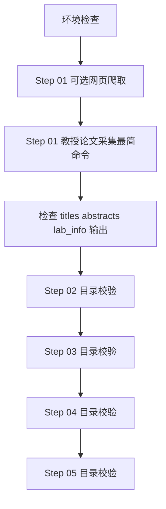

# 数据采集与报告流水线项目（本地部署版）

## 1）项目基础介绍

本项目用于搭建一个本地优先的五阶段信息处理流水线，目标是把网页、论文、实验室线索等原始信息逐步转成可分析、可汇报、可分发的结果。

五个阶段如下：

1. `01_data_collection`：数据采集
2. `02_parsing`：文档解析与结构化
3. `03_feature_extraction`：特征提炼与归纳
4. `04_report_generation`：报告生成与排版
5. `05_delivery`：自动化分发

当前已经真正打通、可直接执行的是 `01_data_collection`。后续 `02` 到 `05` 已完成目录骨架，但暂时还没有独立入口脚本。

## 2）阶段架构介绍

### `01_data_collection`

这是当前最核心、最可用的模块，负责把外部信息采集到本地结果目录。

已实现能力：

1. 本地网页爬取
   - 输入：`01_data_collection/processing/web_crawler_local/crawl_urls.txt`
   - 输出：`01_data_collection/step_results/professor_lab_info/`
2. PubMed 论文标题采集
   - 输出：`01_data_collection/step_results/professor_paper_titles/`
   - 特点：严格按 PMID 去重
3. PubMed 摘要采集
   - 输出：`01_data_collection/step_results/professor_paper_abstracts/`
   - 特点：严格按 PMID 去重
4. 实验室线索聚合
   - 输出：`01_data_collection/step_results/professor_lab_info/`
5. 简化封装命令
   - 只需要输入教授名和该教授署名的一篇文章标题
   - 可选追加额外 URL 作为辅助网页证据

### `02_parsing`

当前是目录骨架，用于承接 Step 01 的输出，并在后续实现中转成结构化 JSON / Markdown。

预期输出目录：

- `02_parsing/step_results/structured_json`
- `02_parsing/step_results/structured_markdown`

### `03_feature_extraction`

当前是目录骨架，用于后续实体抽取、摘要归纳、趋势分析等。

预期输出目录：

- `03_feature_extraction/step_results/entities_relations`
- `03_feature_extraction/step_results/summaries`

### `04_report_generation`

当前是目录骨架，用于后续生成 PPT / PDF 报告。

预期输出目录：

- `04_report_generation/step_results/standardized_reports/pptx`
- `04_report_generation/step_results/standardized_reports/pdf`

### `05_delivery`

当前是目录骨架，用于后续邮件或其他渠道分发结果。

预期输出目录：

- `05_delivery/step_results/distribution_logs`
- `05_delivery/step_results/delivery_receipts`

## 3）推荐执行顺序和命令

### 3.1 执行逻辑图



### 3.2 第一步：环境检查

```powershell
py -3.12 --version
node --version
npm --version
```

### 3.3 第二步：可选执行本地网页爬取

先编辑：

- `01_data_collection/processing/web_crawler_local/crawl_urls.txt`

再执行：

```powershell
python "01_data_collection/processing/web_crawler_local/run_local_crawl.py"
```

### 3.4 第三步：执行教授论文采集最简命令

这是目前最推荐的主命令，会自动完成：

- 标题采集
- 摘要采集
- 实验室线索聚合
- PMID 严格去重

执行命令：

```powershell
powershell -ExecutionPolicy Bypass -File "scripts\bootstrap\run_professor_collection_simple.ps1" `
  -ProfessorName "教授名字" `
  -SeedPaperTitle "种子论文名字" `
  -SeedPMID "种子pid"
```

如果你还要追加额外网页信息源，把 URL 直接写在命令后面：

```powershell
powershell -ExecutionPolicy Bypass -File "scripts\bootstrap\run_professor_collection_simple.ps1" `
  -ProfessorName "教授名字" `
  -SeedPaperTitle "种子论文名字" `
  "新URL" "新URL"
```

### 3.5 第四步：检查 Step 01 输出结果

重点检查这 3 个目录：

- `01_data_collection/step_results/professor_paper_titles/`
- `01_data_collection/step_results/professor_paper_abstracts/`
- `01_data_collection/step_results/professor_lab_info/`

### 3.6 第五步：校验 Step 02 目录

```powershell
New-Item -ItemType Directory -Force "02_parsing/step_results/structured_json" | Out-Null
New-Item -ItemType Directory -Force "02_parsing/step_results/structured_markdown" | Out-Null
```

### 3.7 第六步：校验 Step 03 目录

```powershell
New-Item -ItemType Directory -Force "03_feature_extraction/step_results/entities_relations" | Out-Null
New-Item -ItemType Directory -Force "03_feature_extraction/step_results/summaries" | Out-Null
```

### 3.8 第七步：校验 Step 04 目录

```powershell
New-Item -ItemType Directory -Force "04_report_generation/step_results/standardized_reports/pptx" | Out-Null
New-Item -ItemType Directory -Force "04_report_generation/step_results/standardized_reports/pdf" | Out-Null
```

### 3.9 第八步：校验 Step 05 目录

```powershell
New-Item -ItemType Directory -Force "05_delivery/step_results/distribution_logs" | Out-Null
New-Item -ItemType Directory -Force "05_delivery/step_results/delivery_receipts" | Out-Null
```

说明：

- 目前真正可运行的是 Step 01。
- Step 02 到 Step 05 目前是目录骨架，所以这里给的是最简校验命令，而不是业务执行命令。
- 如果后续你把 Step 02 到 Step 05 的入口脚本补齐，我可以继续把 README 改成真正的端到端执行版。
