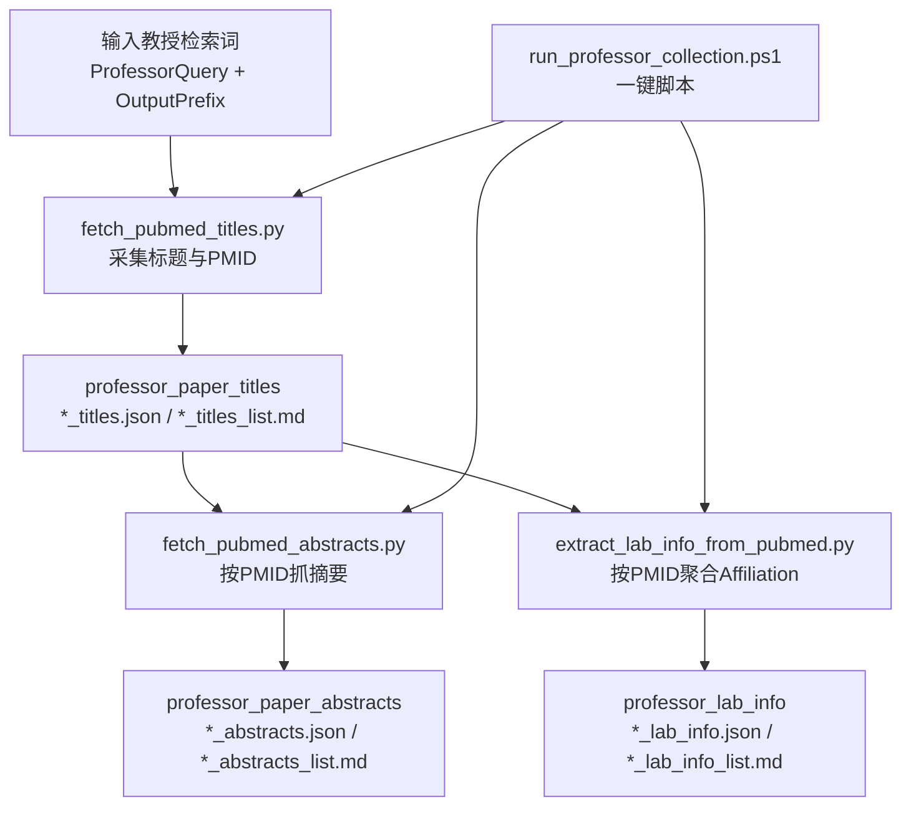

# 数据采集与报告流水线项目

本项目按 5 个步骤组织，采用本地优先执行模式：

1. `01_data_collection`（数据采集）
2. `02_parsing`（文档解析与结构化）
3. `03_feature_extraction`（特征提炼）
4. `04_report_generation`（报告生成）
5. `05_delivery`（自动化分发）

当前已重点打通 `01_data_collection` 的本地可执行链路，其余步骤提供了完整目录骨架与输入输出约定。

## 0）环境准备

需要安装：

- Windows 10/11（PowerShell）
- Python 3.12
- Node.js + npm

检查命令：

```powershell
py -3.12 --version
node --version
npm --version
```

## 1）必须先填写的信息

### 1.1 企业检索请求 YAML（核心输入）

请编辑：

- `01_data_collection/data_sources/request_profiles/enterprise_search.request.template.yaml`

至少填写以下字段：

- `target_company.company_name_zh` 或 `target_company.company_name_en`
- `target_company.official_domains`（至少一个域名）
- `search_scope.time_range.start_date`
- `search_scope.time_range.end_date`
- `collection_objectives.required_questions`

### 1.2 全局默认配置 YAML（流程配置）

配置文件位置：

- `shared/config/enterprise_search.pipeline.defaults.yaml`

该文件用于约束本地执行模式、组件路径与默认输出路径。

### 1.3 环境变量

#### CrewAI

复制并填写：

- `01_data_collection/processing/crewai_scheduler/data_collection_orchestrator/.env.example`

必填：

- `OPENAI_API_KEY`（如果你改用其他模型服务，请同步修改 `agents.yaml`）

#### Bright Data MCP

在目录中创建 `.env`：

- `01_data_collection/processing/brightdata_mcp_connector/service`

必填：

- `API_TOKEN`

可选：

- `GROUPS`（示例：`research,advanced_scraping`）

## 2）执行步骤（全部中文说明，命令可直接执行）

## Step 01：数据采集

### 01-A 本地网页爬取（不需要 API Key）

输入文件：

- `01_data_collection/processing/web_crawler_local/crawl_urls.txt`

执行命令：

```powershell
python "01_data_collection/processing/web_crawler_local/run_local_crawl.py"
```

输出文件：

- `01_data_collection/step_results/professor_lab_info/local_crawl_results.json`
- `01_data_collection/step_results/professor_lab_info/local_crawl_results.md`

### 01-B PubMed 示例采集（作者论文标题）

执行命令：

```powershell
python "01_data_collection/processing/lab_paper_tools/fetch_pubmed_titles.py" --query "Yong-Fei Wang[au]" --output-prefix "pubmed_yong_fei_wang"
```

### 01-C 运行 CrewAI 调度

工作目录：

- `01_data_collection/processing/crewai_scheduler/data_collection_orchestrator`

执行命令：

```powershell
& "01_data_collection/processing/crewai_scheduler/runtime/.venv/Scripts/python.exe" -m src.data_collection_orchestrator.main
```

核心配置文件：

- `01_data_collection/processing/crewai_scheduler/data_collection_orchestrator/src/data_collection_orchestrator/config/agents.yaml`
- `01_data_collection/processing/crewai_scheduler/data_collection_orchestrator/src/data_collection_orchestrator/config/tasks.yaml`

### 01-D 启动 Bright Data MCP（可选）

工作目录：

- `01_data_collection/processing/brightdata_mcp_connector/service`

执行命令：

```powershell
npm install
npm run mcp:start
```

研究工具组模式：

```powershell
npm run mcp:start:research
```

### 01-E 一键执行脚本（新增）

脚本位置：

- `scripts/bootstrap/run_step01_local.ps1`

仅执行本地爬虫：

```powershell
powershell -ExecutionPolicy Bypass -File "scripts/bootstrap/run_step01_local.ps1"
```

执行本地爬虫 + CrewAI：

```powershell
powershell -ExecutionPolicy Bypass -File "scripts/bootstrap/run_step01_local.ps1" -RunCrewAI
```

执行本地爬虫 + CrewAI + 启动 MCP：

```powershell
powershell -ExecutionPolicy Bypass -File "scripts/bootstrap/run_step01_local.ps1" -RunCrewAI -StartMCP
```

### 01-F 实验室论文收集（PubMed 标准流程）

适用场景：

- 指定实验室 PI（作者）批量收集论文标题与 PMID
- 后续用于 `02_parsing` 和 `03_feature_extraction` 的结构化分析

建议先准备检索信息：

- 作者检索词（示例：`huang hsien-da[au]`）
- 可选：机构检索词（如 `Taipei Medical University[ad]`）
- 可选：时间范围（可通过查询词增加条件）

执行命令（按作者检索并写入项目输出）：

```powershell
python "01_data_collection/processing/lab_paper_tools/fetch_pubmed_titles.py" --query "Yong-Fei Wang[au]" --output-prefix "pubmed_yong_fei_wang"
```

输出文件：

- `01_data_collection/step_results/professor_paper_titles/pubmed_yong_fei_wang_titles.json`

摘要采集：

```powershell
python "01_data_collection/processing/lab_paper_tools/fetch_pubmed_abstracts.py" --titles-json "01_data_collection/step_results/professor_paper_titles/pubmed_yong_fei_wang_titles.json" --output-prefix "pubmed_yong_fei_wang"
```

实验室信息提取：

```powershell
python "01_data_collection/processing/lab_paper_tools/extract_lab_info_from_pubmed.py" --titles-json "01_data_collection/step_results/professor_paper_titles/pubmed_yong_fei_wang_titles.json" --output-prefix "pubmed_yong_fei_wang"
```

最简一键命令：

```powershell
powershell -ExecutionPolicy Bypass -File "scripts/bootstrap/run_professor_collection.ps1" -ProfessorQuery "Yong-Fei Wang[au]" -OutputPrefix "pubmed_yong_fei_wang"
```

输出目录：

- 标题：`01_data_collection/step_results/professor_paper_titles`
- 摘要：`01_data_collection/step_results/professor_paper_abstracts`
- 实验室信息：`01_data_collection/step_results/professor_lab_info`

结果解释（建议先看这三条）：

- `professor_paper_titles`：论文标题与 PMID 列表，用于后续抓摘要和关联分析
- `professor_paper_abstracts`：论文摘要正文，用于主题归纳、趋势分析、自动报告草稿
- `professor_lab_info`：按论文作者单位聚合得到的机构候选，不是唯一实验室真值

详细字段说明与核验建议见：

- `01_data_collection/step_results/README.md`

推荐最简工作流（4 步）：

1. 确定作者查询词（先用 `姓名[au]`，必要时加 `机构[ad]`）
2. 执行一键命令（`run_professor_collection.ps1`）
3. 查看 `professor_lab_info` 前 10 条机构是否集中
4. 若混入同名作者，收敛查询词后重新执行

### 01-G Step 01 模块流程图（当前本地部署）



### 01-H Step 01 完整性检查（本地部署）

已实现（可用）：

- 本地网页爬取可执行（`run_local_crawl.py`）
- 教授论文标题采集可执行（`fetch_pubmed_titles.py`）
- 教授论文摘要采集可执行（`fetch_pubmed_abstracts.py`）
- 教授实验室线索聚合可执行（`extract_lab_info_from_pubmed.py`）
- 一键采集入口可执行（`run_professor_collection.ps1`）
- 结果按三类目录落盘（titles / abstracts / lab_info）
- 请求模板与步骤说明文档已提供（含简化命令）

待优化与补充：

- `shared/config/enterprise_search.pipeline.defaults.yaml` 的 `raw_output_dir` 仍指向旧目录，建议改为分类目录或新增 `professor_result_dirs`
- `step_results/raw_multisource_dataset` 目前仍保留，建议标记为 legacy 或迁移清理
- 同名作者消歧目前依赖手工查询词，建议增加自动过滤规则（机构白名单/年份阈值/关键词评分）
- 摘要与实验室信息请求量较大时耗时较长，建议增加重试与缓存机制
- 目前尚未把 Step 01 输出自动推送到 Step 02 输入，建议增加桥接脚本

## Step 02：文档解析与结构化（目录骨架已就绪）

目录：

- `02_parsing/data_sources`
- `02_parsing/processing`
- `02_parsing/step_results`

执行前需补充：

- Unstructured / Marker / PaddleOCR 的配置
- `02_parsing/processing/pydantic_modeling` 下的结构化 schema

预期输出：

- `02_parsing/step_results/structured_json`
- `02_parsing/step_results/structured_markdown`

## Step 03：特征提炼（目录骨架已就绪）

目录：

- `03_feature_extraction/data_sources`
- `03_feature_extraction/processing`
- `03_feature_extraction/step_results`

执行前需补充：

- GLiNER 模型参数
- Ollama 本地模型配置（例如 Qwen2.5）
- 摘要与趋势分析提示词

预期输出：

- `03_feature_extraction/step_results/entities_relations`
- `03_feature_extraction/step_results/summaries`
- `03_feature_extraction/step_results/trend_insights`
- `03_feature_extraction/step_results/report_draft`

## Step 04：报告生成（目录骨架已就绪）

目录：

- `04_report_generation/data_sources`
- `04_report_generation/processing/python_pptx_template_fill`
- `04_report_generation/processing/deeppresenter_visual_loop`
- `04_report_generation/step_results`

执行前需补充：

- PPT 模板（放入 `.../python_pptx_template_fill/templates`）
- DeepPresenter 运行配置与资源

预期输出：

- `04_report_generation/step_results/standardized_reports/pptx`
- `04_report_generation/step_results/standardized_reports/pdf`
- `04_report_generation/step_results/presentation_slides_optimized`

## Step 05：自动化分发（目录骨架已就绪）

目录：

- `05_delivery/data_sources`
- `05_delivery/processing/openclaw_task_listener`
- `05_delivery/processing/distribution_channels/email`
- `05_delivery/step_results`

执行前需补充：

- SMTP 配置
- 收件人列表
- OpenClaw 触发规则

预期输出：

- `05_delivery/step_results/distribution_logs`
- `05_delivery/step_results/delivery_receipts`

## 3）推荐执行顺序

1. 填写企业请求 YAML
2. 填写环境变量（CrewAI / Bright Data MCP）
3. 先执行 Step 01 本地爬虫验证
4. 按需执行 CrewAI 与 MCP
5. 检查 `01_data_collection/step_results` 下分类结果输出
6. 继续进入 Step 02~05 的实现与联调
