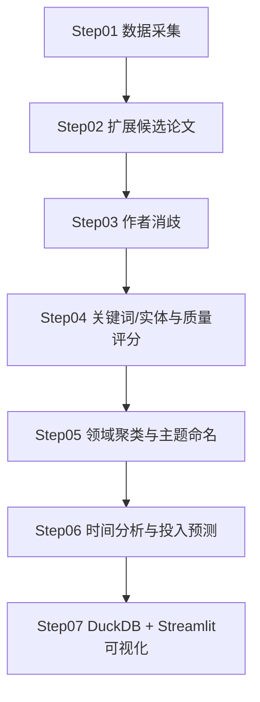
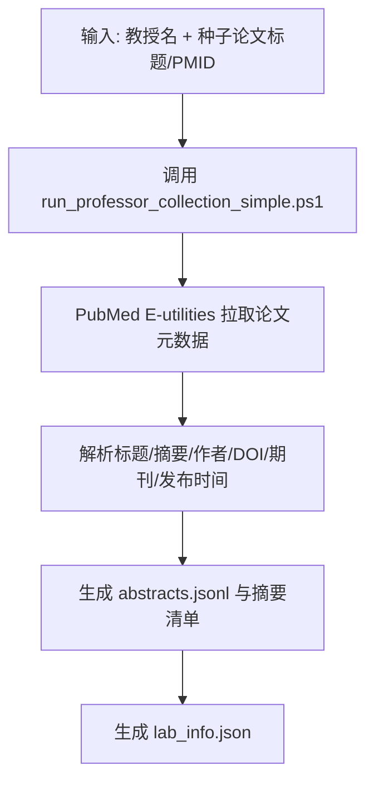
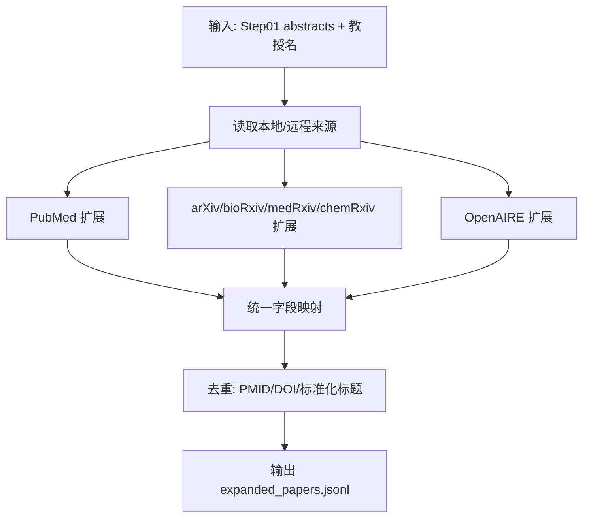
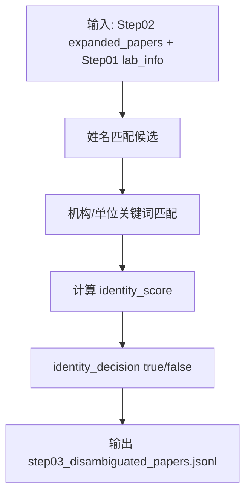
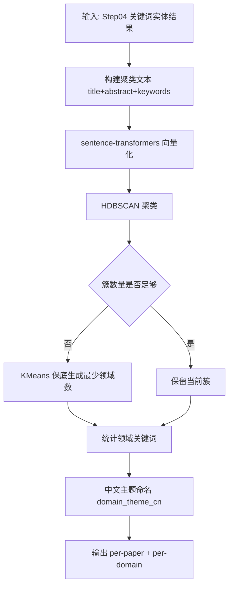
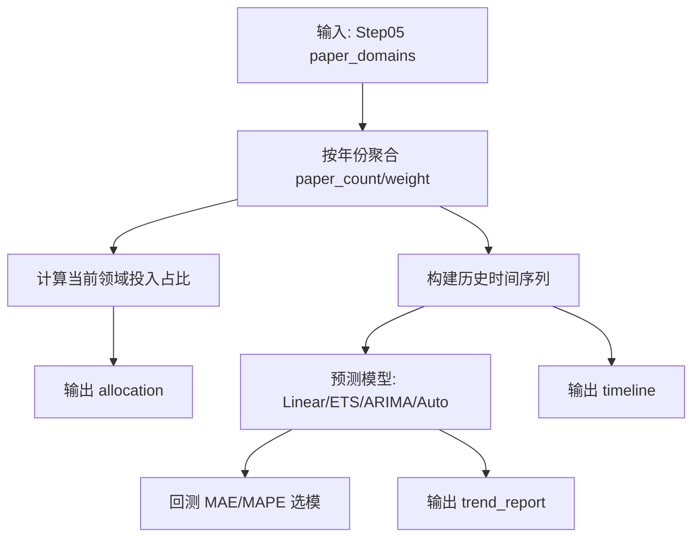
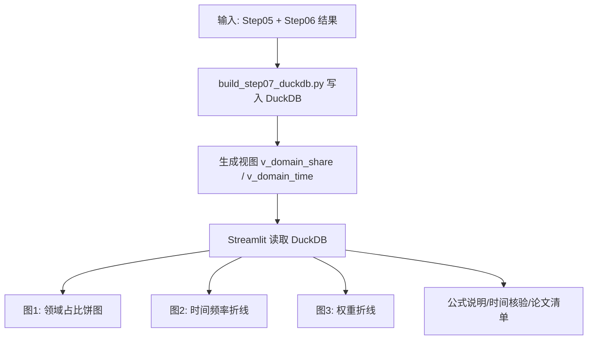

```mermaid
flowchart TD
    A[输入: Step03 消歧后论文] --> B[文本预处理 title+abstract]
    B --> C[KeyBERT 提取关键词]
    B --> D[实体识别(GLiNER/规则)]
    C --> E[项目候选 project_candidates]
    D --> E
    E --> F[质量评分 quality_score 计算]
    F --> G[输出 step04_keyword_entity.jsonl]
```







